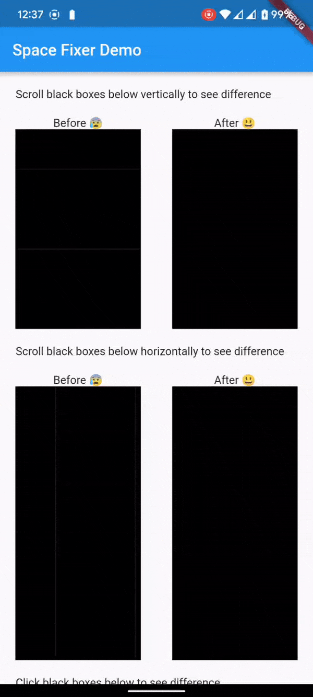

<!--
This README describes the package. If you publish this package to pub.dev,
this README's contents appear on the landing page for your package.

For information about how to write a good package README, see the guide for
[writing package pages](https://dart.dev/guides/libraries/writing-package-pages).

For general information about developing packages, see the Dart guide for
[creating packages](https://dart.dev/guides/libraries/create-library-packages)
and the Flutter guide for
[developing packages and plugins](https://flutter.dev/developing-packages).
-->

# Space Fixer

## Demo



## Features

- Hide unexpected gap between widgets

## Getting started

How It Works


Notes:
- **Blue** -> represent background color (eg. listview container's color)
- **Black** -> represent items (eg. listview children widgets)
- **Red** -> represent `SpaceFixerHorizontalLine` (widget to hide unexpected gap)

## Usage

```bash
flutter pub add space_fixer
```

```dart
import 'package:space_fixer/space_fixer.dart';
```

- `SpaceFixerHorizontalLine()`
- `SpaceFixerVerticalLine()`

```dart
class MyPage extends StatelessWidget {
  const MyPage({Key? key}) : super(key: key);
  @override
  Widget build(BuildContext context) {
    return Column(
      children: [
        Container(
          width: MediaQuery.of(context).size.width,
          height: 50,
          color: Colors.black,
        ),
        
        SpaceFixerHorizontalLine(         //<------- Notice Here 
          overflowHeight: 3,
          overflowColor: Colors.black,
        ),
        
        Container(
          width: MediaQuery.of(context).size.width,
          height: 50,
          color: Colors.black,
        ),
        
      ]
    );
  }
}
```

See: [example1.dart](example/lib/main.dart)

## Additional information

This lib will most likely help to (temporarily) resolve issues like:
unexpected divider, mysterious dividers, unexpected spacing, one pixel line between, dividing lines occur, unwanted divider lines, small gap, lines between items, gaps between items, background color leaks.

- https://github.com/flutter/flutter/issues/14288
- https://github.com/flutter/flutter/issues/15035
- https://github.com/flutter/flutter/issues/29702
- https://github.com/flutter/flutter/issues/37168
- https://github.com/flutter/flutter/issues/39815
- https://github.com/flutter/flutter/issues/42927
- https://github.com/flutter/flutter/issues/44008
- https://github.com/flutter/flutter/issues/46604
- https://github.com/flutter/flutter/issues/54370
- https://github.com/flutter/flutter/issues/58462
- https://github.com/flutter/flutter/issues/58951
- https://github.com/flutter/flutter/issues/62818

## Links
- https://github.com/erlangparasu/space_fixer
- https://pub.dev/packages/space_fixer
